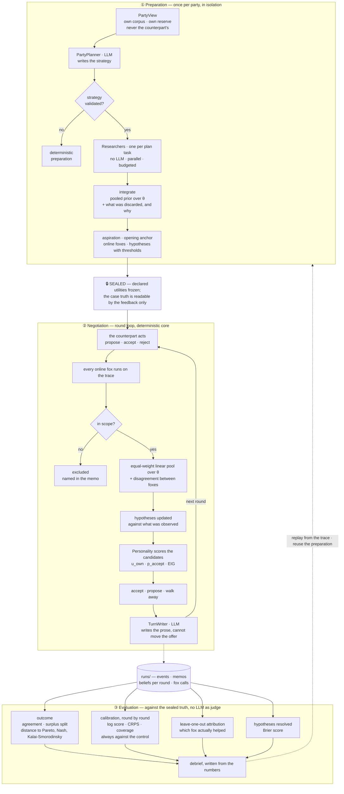

# negotiation-foxes — E1: bilateral negotiation with foxes

A negotiation system between two LLM agents with private information, where every estimate
about the counterpart comes from **foxes**: microtheories calibrated on an explicit dataset that
return distributions, declare their scope and cite the papers they are grounded in.

Status: **Part 1 complete**; **Parts 2 and 3 running end to end** on the real Parker-Gibson case
with Kimi K3 writing the strategies and the prose, and a deterministic core making the decisions.
The plan is in [PLAN.md](PLAN.md); every design decision is in [DECISIONS.md](DECISIONS.md); the
architecture review against the original intent, with what was fixed and what remains, is in
[REVIEW.md](REVIEW.md).

## The architecture: why foxes

The question this system has to answer is not knowable. Across the table sits a counterpart
whose reservation value, issue weights, concession shape and acceptance boundary — call the
whole vector **θ** — are private. Nothing observes θ. All that is ever visible is a short
sequence of offers, and from that sequence an agent has to act before it can be sure.

Tetlock's distinction is the design brief. The **hedgehog** has one big theory and applies it
everywhere; the **fox** holds many small partial models, each true only in its own neighbourhood,
and aggregates them. When the answer is genuinely uncertain, the foxes are better calibrated.
This repository takes that literally: every estimate about the counterpart comes from a fox, and
a fox is a **narrow, specialized ML model over one component of θ** — one estimand, one family of
assumptions, one declared scope, fitted on an explicit dataset.

Four rules turn a fox into something other than an opinion, and the code enforces all four:

1. **It returns a distribution, never a point.** The common interface (`foxes/base.py`) is a
   `Posterior`: weighted samples over the components of θ it claims, with quantiles and entropy.
   An estimator that cannot say how unsure it is cannot enter.
2. **It checks its own scope at runtime**, against the data it actually received — not against
   the data its author imagined. `f01` measures whether there was a concession trend at all;
   `f03` measures whether the time curve fits. Out of scope, the output is flagged and does not
   enter the pool.
3. **It is calibrated and validated on disjoint splits** of the synthetic dataset, and it has to
   beat the uninformed control `f06` on a proper scoring rule — log score, CRPS — to earn the
   `validated` status. A belief that does not beat a flat prior carries no information, however
   narrow it looks.
4. **It declares where it comes from**: the papers, the calibration dataset, the validation
   report, and a status that gates the code itself. A `candidate` fox cannot be instantiated; an
   `implemented` one runs only flagged as experimental, outside the pool.

No single fox is trusted. The in-scope posteriors are combined by an equal-weight linear pool,
and the spread between them is kept as `disagreement_sd` — a signal about how contested the
estimate is, not noise to be averaged away. Every individual posterior is persisted, so that
after the fact the leave-one-out attribution can ask the only question that matters: **which fox
actually earned its place?** In the reference program, one validated fox contributes *negatively*
(D-035, D-047), and the pipeline is built to surface that rather than hide it.

The division of labour follows from the same logic. The language model **writes** — the strategy
in preparation, the memo's reasoning and the message at the table. The foxes **estimate**. The
personality **decides**, deterministically, from the pooled belief. The feedback **scores**,
arithmetically, against the sealed truth: no LLM as judge, anywhere. `TurnWriter` cannot alter an
offer, and if the model fails the turn continues on the deterministic memo. That is what makes a
program replayable — same seed, same trace, same decisions — and what makes every number in a
report traceable to something other than a model's opinion of itself.

### Preparation, negotiation, evaluation



**① Preparation** runs once per party and in isolation: each planner sees only its own
`PartyView`, and a `LeakDetector` watches for the counterpart's material reaching it, including
through a file path. The strategy the model writes is *validated* before it is accepted — the
reservation-value quote has to really appear in that party's own corpus, the value has to sit
inside the case's space, the foxes named have to exist and be usable, and every numeric
hypothesis needs a structured threshold so the feedback can score it later. A strategy that fails
validation is discarded and the party falls back to the deterministic preparation. Then the
declared utilities are **sealed**: from that point nothing in the run may read the case truth.

**② Negotiation** is a round loop with a deterministic core. Each observed action updates every
online fox, the in-scope posteriors are pooled, the open hypotheses are updated against what the
table just revealed, and the personality scores the candidate offers on own utility, estimated
acceptance probability and expected information gain, under a concession policy. The action is
chosen there — by arithmetic. Only afterwards does the model dress it in prose.

**③ Evaluation** opens the sealed envelope. Outcome metrics locate the agreement against the true
Pareto frontier and the Nash and Kalai-Smorodinsky points; calibration scores each round's belief
about the counterpart's reserve against the truth *and* against the uninformed control;
leave-one-out attribution removes each fox from the pool in turn to measure what it contributed;
the registered hypotheses are resolved and scored with Brier. The debrief is written from those
numbers, never the other way round.

## Setup

```bash
uv venv --python 3.11 .venv
VIRTUAL_ENV=$PWD/.venv uv pip install pydantic numpy scipy scikit-learn pandas pyarrow \
    duckdb pyyaml httpx pymupdf tenacity tabulate pytest
```

## Run a complete program

```bash
PYTHONPATH=. .venv/bin/python -m gym.run --case parker_gibson --seed 7
PYTHONPATH=. .venv/bin/python -m feedback.report --program <program_id>
PYTHONPATH=. .venv/bin/python -m gym.replay --program <program_id> --rebuild-db
```

Isolated preparation per party → sealing of the truth → round-by-round negotiation with foxes,
hypotheses and memos → feedback against the sealed truth → deterministic replay from the trace.
The decision core (`ScriptedNegotiator`) never calls the model: with `--with-llm` the model
writes the memo's rationale and the message at the table, not the action, which must stay
auditable.

Batch with a sweep of the RQ2 levers:

```bash
PYTHONPATH=. .venv/bin/python -m gym.batch --seeds 5 --sweep --focal parkers
```

## The model (Kimi K3)

```bash
PYTHONPATH=. .venv/bin/python scripts/check_llm.py     # checks credentials and endpoint
```

Configured in `.env` (`LLM_API_KEY`, `LLM_ENDPOINT`, `LLM_MODEL`). Without credentials the client
raises `CredentialsMissing`: the system does **not** simulate model replies.

Three things kimi-k3 imposes that the client already handles (details in D-036):

- the temperature is fixed at 1; the client detects it and omits the parameter;
- it is a reasoning model: `max_tokens` covers the thinking **and** the reply, so a short budget
  returns empty text. The client retries with double the budget and, if still empty, fails with a
  diagnosis instead of returning nothing;
- it is slow: 600 s timeout, and a read timeout is **not** retried (retrying pays for the same
  work again).

**Division of labour**: the model *writes* (strategy, memo rationale, message at the table); the
foxes and the personality *decide*. `TurnWriter` cannot alter the offer, and if the model fails
the turn continues with the deterministic memo.

### Preparation with the model

```bash
python scripts/run_preparation.py --case parker_gibson                # dry-run: prompt and cost
python scripts/run_preparation.py --case parker_gibson --role parkers --go
```

It does not call the model without `--go`. The strategy it produces is **validated** before it is
accepted: a reservation-value quote that really appears in the party's own corpus, a value inside
the case's space, foxes that exist and are usable, no hypothesis without a test, and a structured
`threshold` on every numeric hypothesis so the feedback can score it.

A later program can reuse a recorded preparation without paying for it again:

```bash
PYTHONPATH=. .venv/bin/python -m gym.run --case parker_gibson --seed 11 --reuse-preparation <program_id>
```

### Dashboard

```bash
.venv/bin/streamlit run dashboard/app.py
```

## Reproduce Part 1 with one command

```bash
bash scripts/run_part1.sh          # full
bash scripts/run_part1.sh --fast   # short version to check the flow
```

Rebuilds: Kosmos report ingestion → metadata resolution → PDF download → text extraction and
SQLite database → verified annotation → synthetic dataset → calibration → validation → reports.

## What is here

| Path | What it is |
|---|---|
| `knowledge/kosmos/` | The source research report |
| `knowledge/db/papers.sqlite` | Papers, authors, Kosmos claims, citations, sections, annotations, FTS5 index |
| `knowledge/db/kb_report.md` | Measured status of the base: what was resolved, downloaded, missing |
| `knowledge/db/review_queue.md` | What needs a human eye, with the citation context in view |
| `catalog/foxes.yaml` | 10 foxes with status, scope, evidence and validation summary |
| `catalog/tools.yaml` | 8 deterministic tools |
| `catalog/rubric.md` | Implementability rubric and reconciliation with the seed catalog |
| `skills/foxes/<fox_id>/` | Usage instructions per fox: when to use it, when not, how to read it |
| `foxes/` | Runtime: common interface, registry, pooling, domain, calibration, validation |
| `data/synthetic/` | 6,000 episodes with known θ ([column dictionary](data/synthetic/COLUMNS.md)) |
| `cases/parker_gibson/` | Real two-sided case (PON/Harvard) with explicit sealed truth on both sides. **Not in this repository** (see Rights) |
| `gym/` | Case with isolation, protocol, trace, program execution, replay and batches |
| `agents/` | Declared utility, personality `econ`, planner, researchers, deterministic negotiator, LLM writer, model client |
| `tools/` | EIG, EVPI, MESO, logrolling, contingent clauses |
| `hypotheses/` | Registry, priority by value of information, thresholds, resolution and Brier |
| `feedback/` | Outcome metrics, calibration, leave-one-out attribution, debrief |
| `dashboard/app.py` | The five views of §11 over `runs/` |

## The foxes

A fox estimates a part of θ (the counterpart's hidden parameters) and **always returns a
distribution**: weighted samples, quantiles, entropy and a scope check.

| Fox | Estimates | Status | What its validation says |
|---|---|---|---|
| `f01_bayes_rv_concession` | reservation value | validated | Beats the control's log score; contributes clearly against conceding counterparts, not against Boulware. In the reference program its leave-one-out contribution is negative (D-035, D-047) |
| `f02_concession_issue_weights` | issue weights | validated | Beats the control's CRPS; not its log score (the control is the generating distribution) |
| `f03_time_concession_regression` | concession shape | validated **for `beta` only** | CRPS 0.34 vs 1.07 for the control on `beta`; the deadline `T` is not recovered — identifiability. In-family validation (REVIEW F11) |
| `f04_accept_boundary_kde` | acceptance probability | implemented | No data inside its scope in this protocol; does not beat predicting the base rate |
| `f05_case_reader_prior` | prior from the corpus | candidate | Needs its validation benchmark (Raiffa's human prior) wired |
| `f06_uninformed_prior` | control | validated | Nominal coverage verified; the reference for all the others; never a pool member |
| `f07_zopa_pareto_estimator` | ZOPA, Pareto, Nash | validated | Error 0.002 with exact θ; propagates without narrowing the uncertainty it receives |
| `f08_outcome_simulator` | outcomes per strategy | implemented | Conditional on the family assumption; validating it belongs to Part 3 |
| `f09_hypothesis_issue_weights` | issue weights | validated | The only weight estimator that beats the control on both scoring rules |
| `f10_impasse_risk` | impasse risk | candidate | Its published calibration is from another domain and its dataset is not accessible |

Three rules the code enforces, not merely documents:

1. **A `candidate` fox cannot be instantiated**, and an `implemented` one runs only when flagged
   experimental, outside the pool (`foxes/registry.py`).
2. **Every fox checks its own scope** on the data it receives. f01 measures whether there was a
   concession trend; f03 measures whether the time curve fits. Out of scope, the output is flagged
   and does not enter the pool.
3. **Calibration and validation use disjoint splits** of the synthetic dataset. No number in a
   validation report comes from data seen while calibrating.

## Demo: the belief chain on an episode with known truth

```bash
PYTHONPATH=. .venv/bin/python scripts/demo_belief.py --family conceder --domain d2_case3
```

Runs the foxes on the observed offers of one episode, pools their posteriors, compares the pool
with the sealed truth, measures the disagreement between foxes, propagates to the ZOPA with f07
and leaves the call trace in `runs/demo_part1/fox_calls.jsonl`. It is the Part 3 gym in
miniature, without LLM agents.

## Run a fox on a trace

```bash
PYTHONPATH=. .venv/bin/python -m foxes.cli --list
bash skills/foxes/f01_bayes_rv_concession/scripts/run.sh trace.jsonl d2_case3
```

## Query the knowledge base

```bash
.venv/bin/python - <<'PY'
import sqlite3
c = sqlite3.connect("knowledge/db/papers.sqlite")
for pid, head, snip in c.execute(
    "SELECT paper_id, heading, snippet(paper_fts,2,'[',']','…',18) FROM paper_fts "
    "WHERE paper_fts MATCH ? LIMIT 5", ('"reservation value" AND deadline',)):
    print(f"{pid:20} {head[:40]:40} {snip[:90]}")
PY
```

## Tests

```bash
PYTHONPATH=. .venv/bin/python -m pytest foxes/tests tests -q
```

117 tests, none touches the API: foxes against known θ, isolation by canary (including an
indirect leak through a file path), decision tools, personality, hypotheses and thresholds,
protocol, deterministic replay across processes and from the trace, DuckDB rebuild, plan-driven
online foxes, and planner validation with a fake client.

## Rights

The Parker-Gibson case is Program on Negotiation material and is not redistributed: the whole
`cases/` directory and `runs/` (every recorded program derives from the case) stay out of this
repository. The tests that load the case are skipped, not failed, when it is absent
(`tests/conftest.py`). The downloaded papers, their extracted text, `knowledge/db/papers.sqlite`
and the metadata cache are regenerable with `scripts/run_part1.sh` and are not committed either.
Credentials live only in `.env`.
